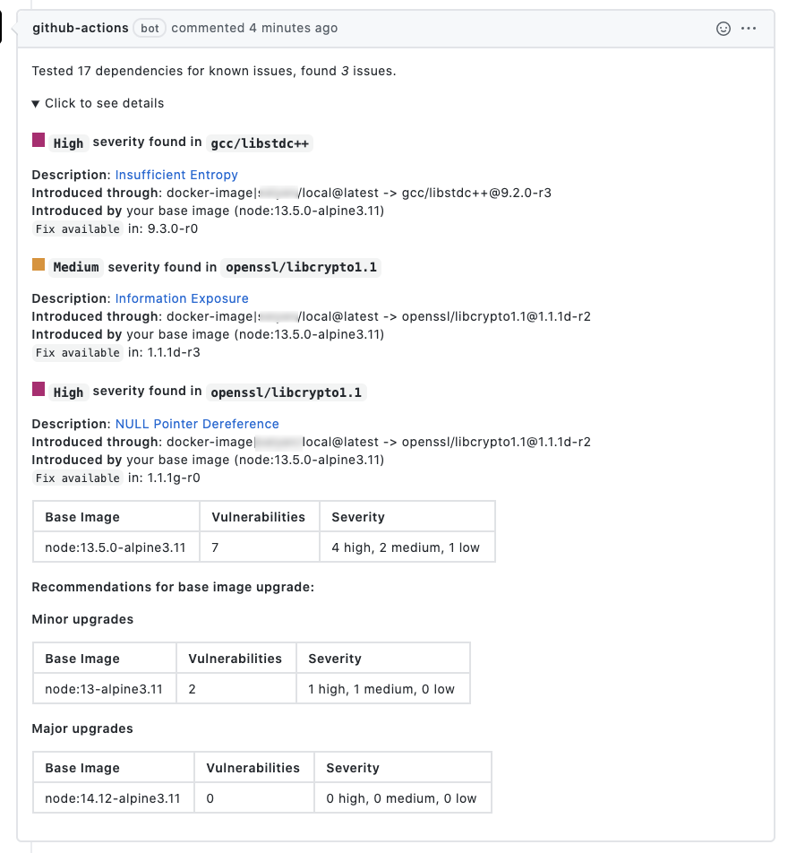

# Snyk to Markdown Github Action

Give container security feedback to your developers directly on their PRs.

## How it works
Takes a `snyk.json` output file and transforms it into human readable markdown. The primary use case for this action is for use within a CI environment where you may want to _ship_ your Snyk findings as a PR comment, or to a Slack channel somewhere.

## Use-case

One such example is to use this in conjunction with [snyk][snyk] test/monitor and [b4den/comment-on-pr][comment] modules. The [comment-on-pr][comment] module is also fully compatible within other CI systems including CircleCI.



### .github/workflows/snyk-action.yml sample
```
name: Snyk container scans
on:
  push:
    branches:
      - master
  pull_request:
    branches:
      - master
jobs:
  snyk:
    runs-on: ubuntu-latest
    steps:
    - uses: actions/checkout@v2
    - name: Build a Docker image
      run: docker build -t "${{ github.event.repository.name }}/local" .
    - name: Run Snyk monitor
      continue-on-error: true
      uses: snyk/actions/docker@master
      env:
        SNYK_TOKEN: ${{ secrets.SNYK_TOKEN }}
      with:
        image: "${{ github.event.repository.name }}/local"
        args: --file=Dockerfile
        json: true
        command: monitor
    - name: Run Snyk tests
      id: scan_image
      continue-on-error: true
      uses: snyk/actions/docker@master
      env:
        SNYK_TOKEN: ${{ secrets.SNYK_TOKEN }}
      with:
        image: "${{ github.event.repository.name }}/local"
        args: --file=Dockerfile
        json: true
        command: test
    - name: Parse results
      id: snyk_results
      uses: b4den/snyk-to-markdown-action@master
      with:
        file-name: snyk.json
    - name: Comment PR
      uses: b4den/comment-pr-action@master
      env:
        GITHUB_TOKEN: ${{ secrets.GITHUB_TOKEN }}
      with:
        message: "${{ steps.snyk_results.outputs.vuln_text }}"
```

## Inputs

### `input-file`

**Required** The location of your input file. Default `snyk.json`.

## Outputs

### `vuln_text`

The markdown formatted text

[comment]: https://github.com/b4den/comment-pr-action
[snyk]: https://github.com/snyk/actions/tree/master/docker
